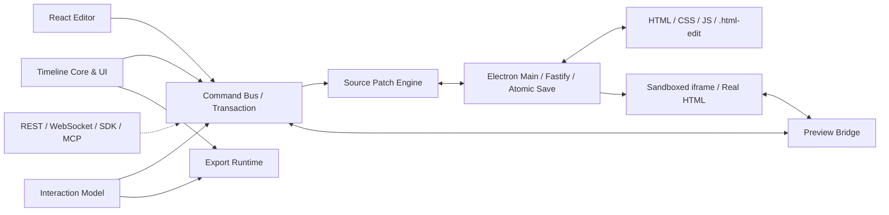

# HTML Edit 第一版研发技术方案

> 状态：**研发基线 v1，已冻结**
> 生效日期：2026-08-20
> 产品边界：[`product-core.md`](product-core.md)
> 原则：人工操作优先；自研产品内核；复用成熟基础库；Agent 不进入前三个月 MVP

## 1. 技术路线

第一版采用本地优先的 Electron 桌面架构，直接打开标准 HTML、CSS、JavaScript 和本地媒体项目。

```text
Electron 43 + Chromium
React 19.2 + TypeScript 5.9 + Vite 8.1
Zustand + Radix UI + CSS Modules

iframe + Preview Bridge + Real DOM
Moveable + Selecto + Monaco

parse5 + Magic String + PostCSS
Self-built Timeline Core / Timeline UI
Web Animations API + HTMLMediaElement

Electron Main Process + Fastify
Vitest + Playwright
Electron Forge + GitHub Actions
```

不以 GrapesJS、Pinegrow、Pencil 或 Webstudio 作为产品底座。HTML Edit 自研：

```text
Preview Bridge
Source Patch Engine
Selection / Command / Transaction / Undo
Timeline Model / Core / UI / Compiler
Interaction Model
Export Runtime
```

标准 HTML、CSS、JavaScript 始终是网页 Source of Truth；`.html-edit` 只保存结构化附加数据。

## 2. 第一版范围

第一版必须形成完整人工闭环：

```text
打开 / 运行 / 保存 / 重开普通 HTML
真实 DOM 选择，Layers / Inspector / Timeline 同步
文字 / 图片 / 视频 / SVG / 属性 / 样式 / 尺寸 / 位置编辑
拖动 / 缩放 / 多选 / 吸附 / 锁定 / 隐藏 / 复制 / 删除
稳定 data-he-id
最小 HTML Patch + generated CSS
Command / Operation / Transaction + Undo / Redo + revision
DOM / Video / Audio / Event 多轨时间线
play / pause / seek / scrub / zoom / move / trim / split / copy / snap / keyframe
点击 / 悬停 / 场景进入 / 进入视口 / 时间事件
标准 HTML 独立导出
Windows 安装包 + 自动测试 + 验收项目
```

明确后置：

```text
React / Vue / Next.js 源码级双向编辑
云账号 / 数据库 / 对象存储 / 多人 CRDT
MCP / REST / WebSocket / Plugin SDK / 正式 Agent
专业调色 / 混音 / AE 合成 / 最终 MP4
Three.js / 3DGS / Lottie Adapter
模板市场 / 素材商城 / CMS
```

## 3. 总体架构



进程边界：

```text
Electron Main = 窗口 / 文件 / 本地协议 / Fastify / 原子保存 / 恢复
Preload       = 白名单 IPC + Schema 校验
Renderer      = UI / 选择 / 命令 / Timeline / Interaction
iframe        = 真实用户 HTML / DOM / 动画 / 媒体
Bridge        = DOM 摘要 / 选择 / Preview Mutation / Runtime 通信
```

安全固定项：

```text
nodeIntegration: false
contextIsolation: true
sandbox: true
webSecurity: true
```

不使用 `<webview>`；iframe 只加载绑定 `127.0.0.1` 随机端口的受控服务；每次预览使用随机 session token；校验 IPC sender、origin、session、消息 Schema 和项目路径；外链、弹窗、下载和导航默认受限；保存失败不得覆盖最后有效文件。

## 4. 项目模型与稳定 ID

```text
user-project/
├─ index.html
├─ styles/
├─ scripts/
├─ assets/
├─ html-edit.generated.css
└─ .html-edit/
   ├─ project.json
   ├─ timeline.json
   ├─ interactions.json
   └─ history/
```

```text
HTML / CSS / JavaScript = 真正网页
project.json             = 入口、页面、素材、版本和设置
timeline.json            = 场景、轨道、片段和关键帧
interactions.json        = 触发器、动作和状态
html-edit.generated.css  = 可视化编辑产生的受控样式
```

持久编辑对象必须拥有稳定 ID：

```html
<h1 data-he-id="he_01J...">标题</h1>
```

ID 必须项目内唯一、创建后稳定、复制时更新、删除后不复用，并由 Source Patch、Timeline、Interaction 和 History 共用。不得长期依赖 `:nth-child()`、XPath、DOM index、临时图层顺序或单一 CSS class。

## 5. Command 与事务

```text
UI Intent
→ Command
→ Operation
→ Transaction
→ Project / Source / Timeline / Interaction Service
→ Preview
→ Save
```

```ts
type Operation = {
  id: string;
  projectId: string;
  revision: number;
  type:
    | "element.text.set"
    | "element.attribute.set"
    | "element.style.set"
    | "element.transform.set"
    | "timeline.clip.update"
    | "timeline.keyframe.upsert"
    | "interaction.upsert";
  targetId?: string;
  payload: unknown;
  source: "human" | "system" | "future-agent";
};
```

规则：

- 每种 Operation 有独立 Zod Schema；
- 执行前检查 `revision`；
- 拖动时只更新 Preview，松开后提交一个 Transaction；
- Transaction 记录 Operations、inverse/快照和受影响文件；
- Undo / Redo 操作 Transaction，不直接改 Zustand；
- Preview-only Mutation 不得绕过 Command Bus 持久化；
- 未来 Agent 只能提交相同 Command。

## 6. Preview Bridge

Bridge 负责：ready/error、DOM tree、hover/select、稳定 ID 命中、元素边界、computed style、文字和媒体信息、Preview Mutation、WAAPI/媒体控制、截图、console/runtime error、iframe 缩放与坐标映射。

Bridge 由 Preview Server 在内存响应阶段注入，不永久写入项目。消息必须包含 `sessionId`，并校验来源和 Schema。

```ts
interface CanvasAdapter {
  load(entryUrl: string): Promise<void>;
  getTree(): Promise<DomNodeSummary[]>;
  select(targetId: string | null): Promise<void>;
  inspect(targetId: string): Promise<ComputedElementSnapshot>;
  applyPreview(operations: PreviewOperation[]): Promise<void>;
}
```

未来若改用 WebContentsView，只替换 Adapter，不修改 Command、Timeline 和项目数据。

## 7. Source Patch Engine

禁止：

```text
HTML → DOM → 修改 → outerHTML → 整页覆盖
```

HTML 回写：

```text
原始 HTML
→ parse5 + sourceCodeLocationInfo
→ Source Index
→ 根据 data-he-id 定位源码区间
→ Magic String 生成最小 Patch
→ 重新解析校验
→ 原子保存
→ 重建 Source Index
```

CSS 回写：

- 可视化样式默认写入 `html-edit.generated.css`；
- PostCSS 维护一个 `targetId` 对应一个受控 selector；
- 删除无用声明和空规则；
- Inspector 区分 computed、source 和 HTML Edit override；
- MVP 不自动重写用户原 CSS。

保存采用同目录临时文件、`fsync`、原子 rename、必要历史和 revision；多文件修改使用 Transaction Manifest，避免 HTML、CSS 和 JSON 半提交。

最小 PoC：

```ts
import { parse } from "parse5";
import MagicString from "magic-string";

export function patchText(
  html: string,
  start: number,
  end: number,
  nextText: string,
): string {
  const source = new MagicString(html);
  source.update(start, end, nextText);
  const result = source.toString();
  parse(result, { sourceCodeLocationInfo: true });
  return result;
}
```

正式实现必须由 Source Index 取得 `start/end`，并加入 escaping、属性 Patch、结构操作、格式保持、文件锁、revision 和 Transaction。

## 8. 数据 Schema

三类文件均保留 `schemaVersion`，启动时通过 Zod 校验；未知版本只读打开；migration 可测试、可回滚，并采用稳定排序减少无意义 Diff。

```json
{
  "project.json": {
    "schemaVersion": 1,
    "projectId": "project_demo",
    "entry": "index.html",
    "stableIdAttribute": "data-he-id",
    "fps": 30,
    "revision": 12
  },
  "timeline.json": {
    "schemaVersion": 1,
    "durationMs": 12000,
    "tracks": [
      {
        "type": "dom-animation",
        "targetId": "he_title",
        "clips": [
          {
            "startMs": 1000,
            "durationMs": 1500,
            "keyframes": [
              { "timeMs": 0, "property": "opacity", "value": 0 },
              { "timeMs": 1500, "property": "opacity", "value": 1 }
            ]
          }
        ]
      }
    ]
  },
  "interactions.json": {
    "schemaVersion": 1,
    "interactions": [
      {
        "targetId": "he_cta",
        "trigger": { "type": "click" },
        "actions": [
          { "type": "timeline.play", "timelineId": "timeline_main" }
        ]
      }
    ]
  }
}
```

## 9. Timeline 与 Interaction

```text
Timeline
├─ Scene
├─ Track
│  └─ Clip
│     └─ Keyframe
└─ Marker / Event
```

第一版 Track 为 `dom-animation`、`video`、`audio`、`event`。必须支持 Play/Pause/Seek/Scrub、Playhead/Zoom/Snap、Move/Trim/Split/Copy、Lock/Hide/Mute、Keyframe、基础 Easing 和 DOM/Video/Audio 同步；高级曲线、调色、混音和 AE 合成后置。

```text
timeline.json
→ Normalize / Validate
→ Playback Plan
→ DOM → Web Animations API
→ Video / Audio → HTMLMediaElement
→ Event → Interaction Runtime
```

时间以整数毫秒存储；`fps=30` 只用于显示、吸附和帧步进；Core 不保存 WAAPI、GSAP 或 React 状态；播放使用统一 logical clock；`seek(timeMs)` 必须可重复、可测试；Timeline UI 与 Core 分离。

第一版 Trigger：`click`、`hover-enter`、`hover-leave`、`scene-enter`、`in-view`、`time`。
第一版 Action：`timeline.play/pause/seek`、`element.show/hide`、`state.set`、`media.play/pause`、`navigation.anchor/scene`。

Trigger 与 Action 均有 Schema；Preview 与 Export 共用 Compiler；缺失引用时明确报错；禁止把产品交互散落为不可审查的内联脚本。

## 10. UI/UX 基线

固定工作区：

```text
顶部工具栏
左侧 Layers / Scenes / Assets
中央 Real HTML Canvas
右侧 Layout / Style / Animation / Interaction
底部 Timeline
```

第一轮只重点验证“打开项目、点击元素、修改文字、创建动画、编辑视频”五条路径。要求直接操作、即时反馈、统一 Selection Store、专业快捷键、错误可见、源码变更可审查；第一版优先信息层级、密度和反馈，不优先品牌动效。

## 11. 十二周计划

| 周 | 交付 |
|---|---|
| W1 | Electron / React / Vite 骨架、进程边界、Zod、Command Bus、Undo/Redo、五条 UX 流程 |
| W2 | 项目打开、Fastify、Range、sandboxed iframe、session、错误面板 |
| W3 | Preview Bridge、DOM 选择、Layers、Moveable、Selecto、`data-he-id` |
| W4 | 文字/属性/样式修改、HTML/CSS Patch、Transaction、原子保存、重开验收 |
| W5 | Scene/Track/Clip/Keyframe Schema、Playhead、Zoom |
| W6 | Move/Trim/Split/Copy/Snap/Lock/Hide/Mute、Undo |
| W7 | Playback Plan、WAAPI、关键帧、easing、seek/scrub |
| W8 | HTMLMediaElement、in/out、媒体状态、统一回看 |
| W9 | Trigger/Action、点击/悬停/场景/视口/时间事件 |
| W10 | 快捷键、Inspector、Monaco/Diff、Assets、Preview Mode、错误反馈 |
| W11 | 多文件原子提交、恢复、file watcher、Vitest、Playwright、性能基线 |
| W12 | GitHub Actions、Windows 安装包、Demo、完整验收、下一阶段入口 |

```text
阶段一：HTML → 选择 DOM → 修改 → Undo/Redo → 保存 → 重开
阶段二：DOM + Video + Audio 时间线，任意 seek / scrub 状态正确
阶段三：交互触发，Preview 与 Export 一致，Windows 安装包可运行
```

## 12. 测试、CI 与风险

测试覆盖 Schema、stable ID、Command、Transaction、revision、Timeline 时间映射、trim/split、Interaction Compiler、HTML Patch、generated CSS、migration 和原子保存失败路径。

Golden Projects 覆盖单文件、多文件、图片/SVG/视频/音频、Flex/Grid/absolute、复杂源码、运行错误、大 DOM 和长 Timeline。Playwright 验证：

```text
open-project / select-element / edit-text / edit-style / drag-resize
undo-redo / save-reopen / timeline-keyframe / timeline-scrub
video-trim / interaction-click / export-open
```

CI 固定为：

```text
install → lint → typecheck → unit test → build
→ Playwright smoke → Electron package → upload artifact
```

主要风险与控制：

- 任意 HTML 回写：MVP 限定普通 HTML，source location + 最小 Patch，复杂结构显式降级；
- CSS cascade：generated CSS，显示 computed/source/override，不自动重写原 CSS；
- 页面安全：sandbox、禁用 Node、随机 session、白名单 IPC、路径校验；
- iframe 坐标：单一坐标模块、缩放/滚动测试、CanvasAdapter 隔离；
- 媒体 scrub：logical clock、ready/pending/error、统一 seek；
- Timeline 性能：Core 与 View 分离，预留虚拟化；
- Undo 碎片：Preview 与 Commit 分离，手势合并为单 Transaction；
- 外部冲突：revision、file watcher、重新读取和可见冲突提示；
- 过早扩展：三阶段 Gate，新增能力先通过产品成立标准。

## 13. Agent 接入边界

前三个月只保留：

```text
Command / Operation / Transaction
Zod Schema / targetId / revision
可记录、可比较、可撤销的变更
```

后续顺序：

```text
Plugin Host
→ 本地 REST / WebSocket
→ Plugin SDK
→ MCP
→ 专业 Agent
→ 云端协作
```

未来 Agent 只能走：

```text
结构化 Command
→ Schema 与 revision 校验
→ Preview
→ Diff
→ 人工确认
→ Transaction
→ Save
```

Agent 不得直接修改 DOM、源文件、Timeline JSON 或绕过 Undo / Redo。

## 14. 完成定义

只有在代表性普通 HTML 项目上稳定完成以下闭环，第一版才算成立：

```text
打开真实项目
→ 选择真实 DOM
→ 修改文字、素材、样式和位置
→ 创建 DOM 动画并编辑视频/音频
→ 拖动 Playhead 正确回看
→ 配置页面交互
→ Undo / Redo
→ 安全保存
→ 关闭并重新打开
→ 标准 HTML 项目仍正确且可独立运行
```

在此之前，不启动以 Agent、云端、模板市场、框架源码级编辑或最终 MP4 导出为主线的开发。
